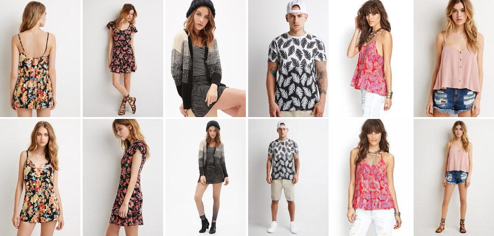
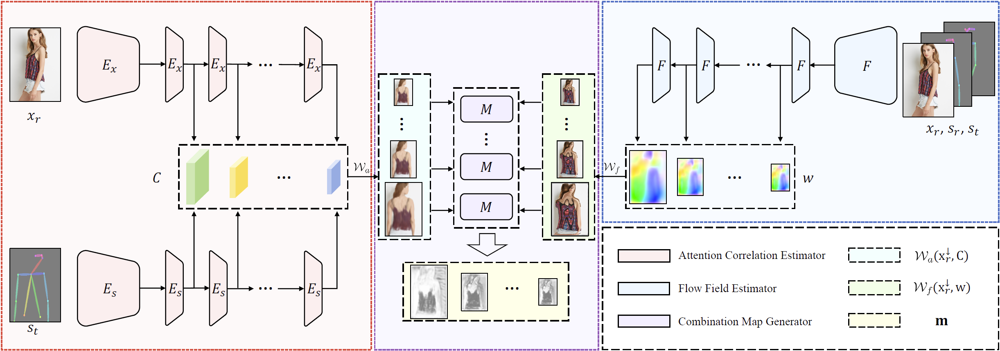
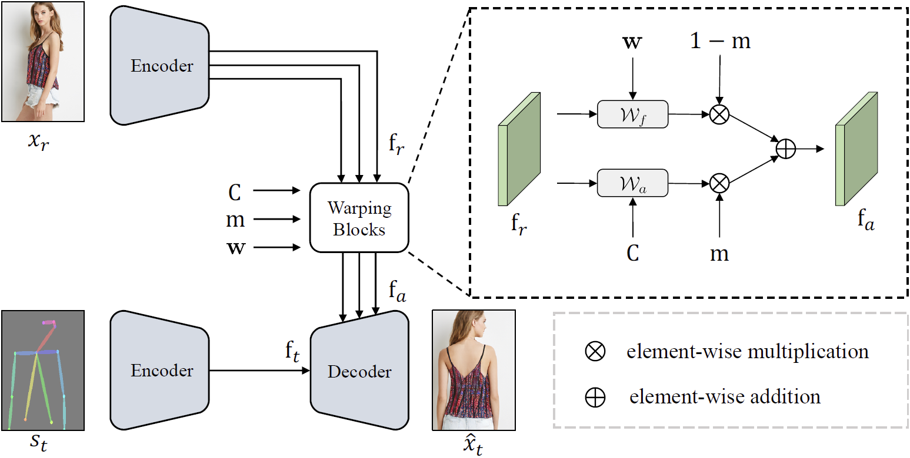
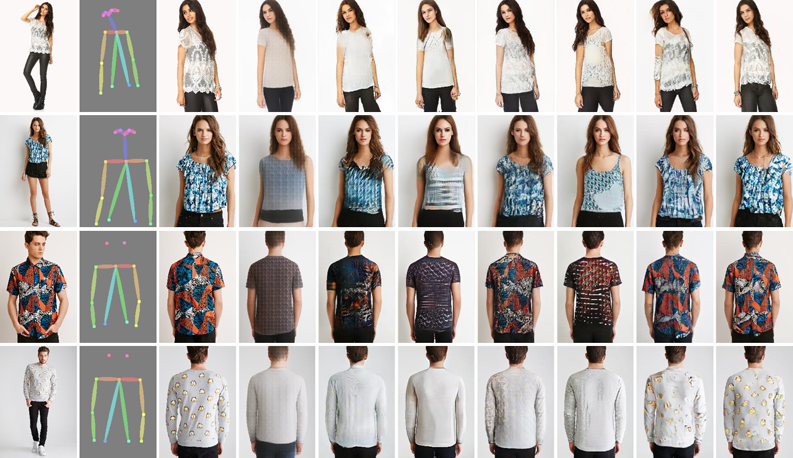
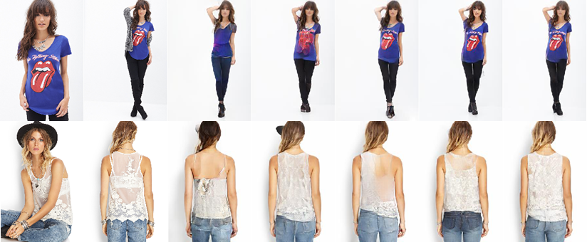

  
  

# **Abstract**

**Pose-guided person image synthesis** aims to synthesize person images by transforming reference images into target poses. 
In this paper, we observe that the commonly used spatial transformation blocks have complementary advantages. 
We propose a novel model by combining the **attention operation** with the **flow-based operation**. 
Our model not only takes the advantage of the attention operation to generate accurate target structures but also uses the flow-based operation to sample realistic source textures. 
Both objective and subjective experiments demonstrate the superiority of our model. 
Meanwhile, comprehensive ablation studies verify our hypotheses and show the efficacy of the proposed modules. 
Besides, additional experiments on the portrait image editing task demonstrate the versatility of the proposed combination.

# **Network Architecture**

### **Deformation Estimation Module**

  
  

### **Image Synthesis Module**

  
  

# **Results**

### **Pose-Guided Person Image Synthesis**

  
  

From Left to Right: Source, Target Pose, Target Image, 
VU-Net, Def-GAN, Pose-Attn, Intr-Flow, ADGAN, GFLA, Ours.

 

### **Ablation Study**

  
  

From Left to Right: Source, Target Image, Baseline
Attn Model, Flow Model, w/o face, Full Model.

 

### **Portrait Image Editing**

  
  

